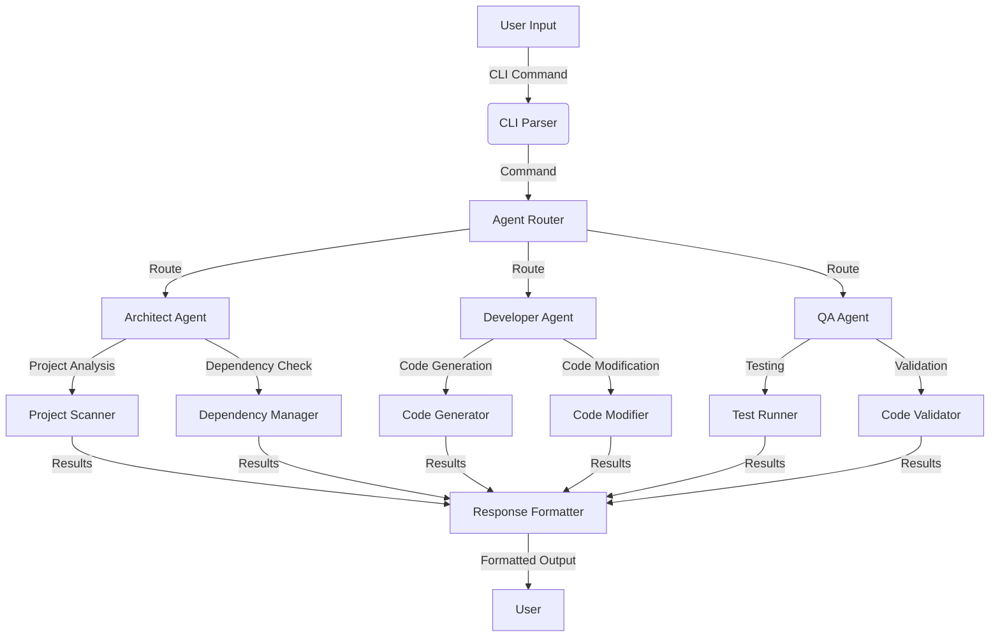

# System Architecture

## Overview

The AI Development Team is built around a modular, agent-based architecture where each agent specializes in a specific aspect of the software development lifecycle. The system is designed to be extensible, allowing new agents and capabilities to be added with minimal friction.

## Core Components

### 1. Agent System

#### Agent Base
- **Base Class**: `Agent` (in `agent_core/base.py`)
  - Defines the interface for all agents
  - Handles message passing and context management
  - Provides lifecycle methods for agent operations

#### Agent Roles
- **Architect**: Responsible for system design and project analysis
- **Developer**: Handles code generation and implementation
- **QA**: Manages testing and quality assurance
- **Technical Writer**: Creates and maintains documentation

### 2. Communication Layer

- **Message Passing**: Agents communicate through structured messages
- **Context Sharing**: Shared context maintains project state and data
- **Event System**: For system-wide notifications and triggers

### 3. Project Analysis

- **ProjectScanner**: Discovers and analyzes project structure
- **DependencyManager**: Handles package dependencies
- **CodeAnalyzer**: Performs static code analysis

## Data Flow



## Directory Structure

```
ai_development_team/ (Main tool repository)
├── agent_core/               # Core agent logic and implementations
│   ├── agents/               # Agent implementations
│   │   ├── architect/        # System architecture agent
│   │   ├── developer/        # Development agent
│   │   ├── qa_engineer/      # Quality assurance agent
│   │   └── technical_writer/ # Documentation agent
│   ├── base/                 # Base agent classes
│   └── orchestration/        # Agent coordination and workflow management
├── config/                   # Configuration files
├── docs/                     # Project documentation
│   └── prds/                 # Product Requirements Documents
├── examples/                 # Example usage scripts
├── interfaces/               # User interfaces
│   └── cli/                  # Command-line interface
│       └── commands/         # CLI command modules
├── services/                 # Shared services
│   ├── documentation/        # Documentation generation
│   ├── llm/                  # Language model integration
│   │   └── prompts/          # Prompt templates
│   └── version_control/      # Version control operations
├── tests/                    # Automated tests
├── workflows/                # Workflow definitions
│   ├── examples/             # Example workflows
│   ├── standard/             # Standard workflow templates
│   └── templates/            # Workflow templates
├── .gitignore               # Specifies intentionally untracked files
├── pyproject.toml           # Project metadata and dependencies
├── README.md                # Main project README
└── setup.sh                 # Setup script

# Gitignored directories
build/                      # Build artifacts
dev_client_output/         # Local sandbox for testing
workspace/                  # Agent working files
```

## Generated Artifacts and Output Management

To maintain clarity and separation of concerns, generated files are categorized and managed as follows:

### Type A: Client Deliverables
- **Description:** The final, clean, runnable code and project files produced by the `ai_development_team` tool for an end-user or client. This is the primary "product" of the tool.
- **Location:** Generated into a dedicated external directory, specified by the user at runtime (e.g., `/path/to/client_repositories/client_project_name/`).
- **Repository Management:** Each client project resides in its own separate Git repository, independent of the `ai_development_team` tool's repository. These client repositories are version-controlled and shared with the client (e.g., via GitHub).

### Type B: AI Agent's Working Files for Client Projects
- **Description:** Files generated by the `ai_development_team` tool *during the process of working on a specific client project*. These are not part of the client deliverable but are essential for the AI's operation, debugging, iteration, and state management for that specific generation task.
- **Examples:** Detailed logs of the generation process, intermediate or unrefined code snippets, task lists, serialized agent memory, workflow status, internal progress reports related to a specific client project generation session.
- **Location:** `ai_development_team/workspace/<client_project_session_id>/`. This directory is gitignored within the `ai_development_team` repository.

### Type C: `ai_development_team` Tool's Own Development & Testing Artifacts
- **Description:** Files generated when the development team is building, testing, or demonstrating the *core capabilities of the `ai_development_team` tool itself*, independent of any specific, ongoing client project generation.
- **Examples:** Outputs from internal example scripts (e.g., `ai_development_team/examples/basic_usage.py` generating a sample module), unit test reports (e.g., code coverage), or outputs from workflows run solely to test the workflow mechanism.
- **Location:** `ai_development_team/build/`. This directory is gitignored. Subdirectories like `build/examples_output/` or `build/test_reports/` organize these artifacts.

### Local Development Sandbox for Client Project Generation
- **`ai_development_team/dev_client_output/`:** A gitignored directory within the `ai_development_team` repository. It serves as a convenient local sandbox for developers to test the full client project generation workflows without writing to external client repository paths during iterative development of the generation logic.

This structured approach ensures that client deliverables are kept pristine, the AI's operational data is available for its processes, and the tool's own development artifacts are managed separately.

## Agent Lifecycle

1. **Initialization**
   - Agent is instantiated with configuration
   - Dependencies are injected
   - Initial state is set up

2. **Message Processing**
   - Receives message from CLI or other agents
   - Processes message based on agent's capabilities
   - May interact with other agents or services

3. **Response Generation**
   - Formats response based on request
   - Returns structured data or formatted output

## Extension Points

1. **Adding New Agents**
   - Create a new agent class inheriting from `Agent`
   - Implement required methods
   - Register the agent in the agent registry

2. **Adding New Commands**
   - Create a new command module in `interfaces/cli/commands/`
   - Define command functions with appropriate decorators
   - Register commands in the CLI app

## Dependencies

- **Core Dependencies**: Python 3.9+

- **Main Libraries**:
  - `typer[all]>=0.9.0` - CLI interface with rich features
  - `rich>=13.0.0` - Terminal formatting and UI
  - `pydantic>=2.0.0` - Data validation and settings management
  - `python-dotenv>=1.0.0` - Environment variable management
  - `click>=8.0.0` - CLI toolkit
  - `pyyaml>=6.0.0` - YAML parsing and serialization

- **Development Dependencies**:
  - `black>=23.0` - Code formatting
  - `isort>=5.12.0` - Import sorting
  - `flake8>=6.0.0` - Linting
  - `mypy>=1.0.0` - Static type checking
  - `pytest>=7.0.0` - Testing framework
  - `pytest-cov>=4.0.0` - Test coverage
  - `pre-commit>=3.0.0` - Git pre-commit hooks
  - `pytest-mock>=3.10.0` - Mocking for tests
  - `types-PyYAML>=6.0.0` - Type stubs for PyYAML

## Performance Considerations

- **Caching**: Heavy operations are cached where possible
- **Parallelism**: Agents can operate in parallel when independent
- **Resource Management**: Resources are cleaned up after operations

## Security

- Input validation on all external inputs
- Safe handling of file system operations
- No execution of untrusted code by default

## Future Enhancements

1. **Plugin System**: For extending agent capabilities
2. **Web Interface**: Browser-based UI for interaction
3. **Cloud Integration**: For distributed agent operations
4. **AI Model Management**: For updating and managing AI models
