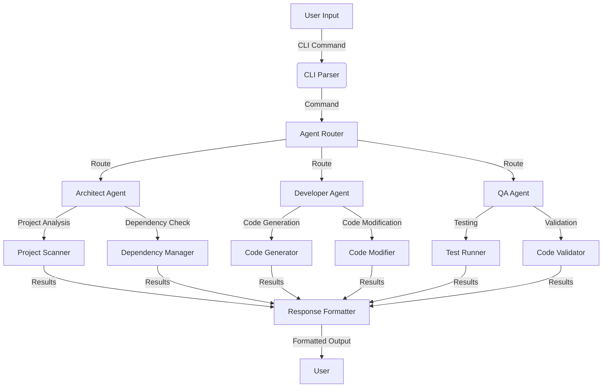

# System Architecture

## Overview

The AI Development Team is built around a modular, agent-based architecture where each agent specializes in a specific aspect of the software development lifecycle. The system is designed to be extensible, allowing new agents and capabilities to be added with minimal friction.

## Core Components

### 1. Agent System

#### Agent Base
- **Base Class**: `Agent` (in `agent_core/base.py`)
  - Defines the interface for all agents
  - Handles message passing and context management
  - Provides lifecycle methods for agent operations

#### Agent Roles
- **Architect**: Responsible for system design and project analysis
- **Developer**: Handles code generation and implementation
- **QA**: Manages testing and quality assurance
- **Technical Writer**: Creates and maintains documentation

### 2. Communication Layer

- **Message Passing**: Agents communicate through structured messages
- **Context Sharing**: Shared context maintains project state and data
- **Event System**: For system-wide notifications and triggers

### 3. Project Analysis

- **ProjectScanner**: Discovers and analyzes project structure
- **DependencyManager**: Handles package dependencies
- **CodeAnalyzer**: Performs static code analysis

## Data Flow



## Directory Structure

```
ai_development_team/
├── agent_core/
│   ├── agents/           # Agent implementations
│   │   ├── architect/    # Architect agent
│   │   ├── developer/    # Developer agent
│   │   └── qa/           # QA agent
│   ├── base.py           # Base agent class
│   └── registry.py       # Agent registration
├── interfaces/
│   └── cli/             # Command-line interface
│       ├── commands/     # CLI command modules
│       └── main.py       # CLI entry point
├── services/             # Shared services
│   ├── analysis/        # Code analysis
│   ├── generation/      # Code generation
│   └── validation/      # Validation services
└── config/              # Configuration
```

## Agent Lifecycle

1. **Initialization**
   - Agent is instantiated with configuration
   - Dependencies are injected
   - Initial state is set up

2. **Message Processing**
   - Receives message from CLI or other agents
   - Processes message based on agent's capabilities
   - May interact with other agents or services

3. **Response Generation**
   - Formats response based on request
   - Returns structured data or formatted output

## Extension Points

1. **Adding New Agents**
   - Create a new agent class inheriting from `Agent`
   - Implement required methods
   - Register the agent in the agent registry

2. **Adding New Commands**
   - Create a new command module in `interfaces/cli/commands/`
   - Define command functions with appropriate decorators
   - Register commands in the CLI app

## Dependencies

- **Core Dependencies**: Python 3.9+
- **Main Libraries**:
  - `typer` for CLI interface
  - `rich` for terminal formatting
  - `pydantic` for data validation
  - `pytest` for testing

## Performance Considerations

- **Caching**: Heavy operations are cached where possible
- **Parallelism**: Agents can operate in parallel when independent
- **Resource Management**: Resources are cleaned up after operations

## Security

- Input validation on all external inputs
- Safe handling of file system operations
- No execution of untrusted code by default

## Future Enhancements

1. **Plugin System**: For extending agent capabilities
2. **Web Interface**: Browser-based UI for interaction
3. **Cloud Integration**: For distributed agent operations
4. **AI Model Management**: For updating and managing AI models
